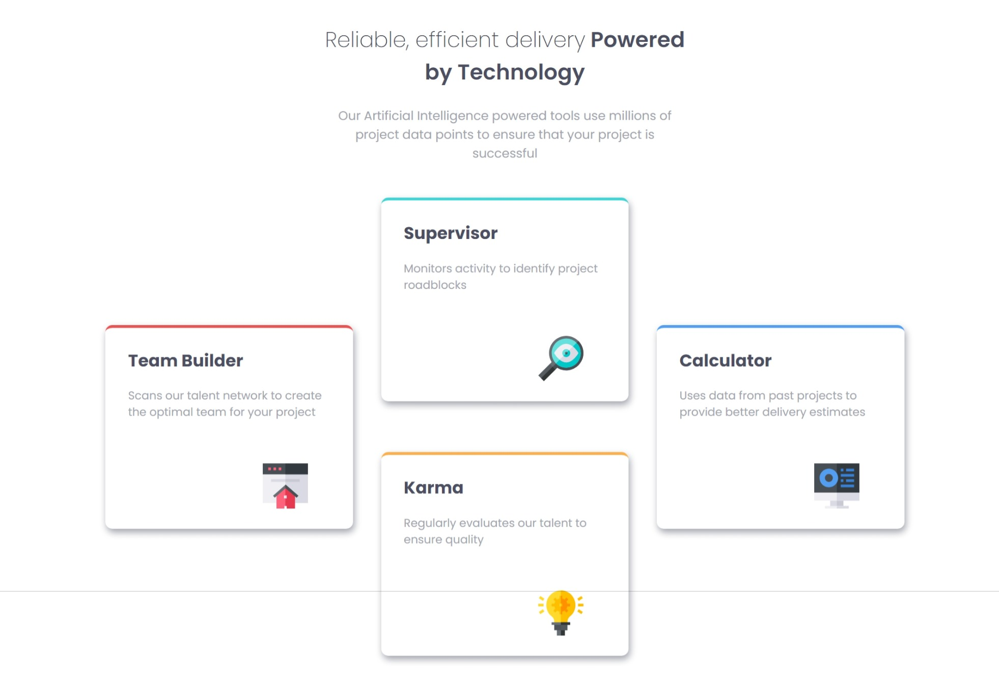

# Frontend Mentor - Four card feature section solution

This is a solution to the [Four card feature section challenge on Frontend Mentor](https://www.frontendmentor.io/challenges/four-card-feature-section-weK1eFYK). Frontend Mentor challenges help you improve your coding skills by building realistic projects. 

## Table of contents

- [Overview](#overview)
  - [The challenge](#the-challenge)
  - [Screenshot](#screenshot)
- [My process](#my-process)
  - [Built with](#built-with)
  - [Skills](#the-skills-i've-used)

## Overview

### The challenge

Users should be able to:

- View the optimal layout for the site depending on their device's screen size

### Screenshot

## My process

### Built with

- Semantic HTML5 markup
- CSS custom properties
- Flexbox
- CSS Grid
- Mobile-first workflowy
- JavaScript

### the skill I've used

- Generate Content Dynamically: Use JavaScript to create and inject HTML based on data.
- Optimize Performance: Build HTML in a string and update the DOM in one go for efficiency.
- Apply Styles Dynamically: Use JavaScript to assign CSS classes for styling based on data.
- Follow Best Practices: Write cleaner code with template literals and consider performance and security.
- Create Responsive Designs: Use CSS Grid and Flexbox for layouts that adapt to different screen sizes.
